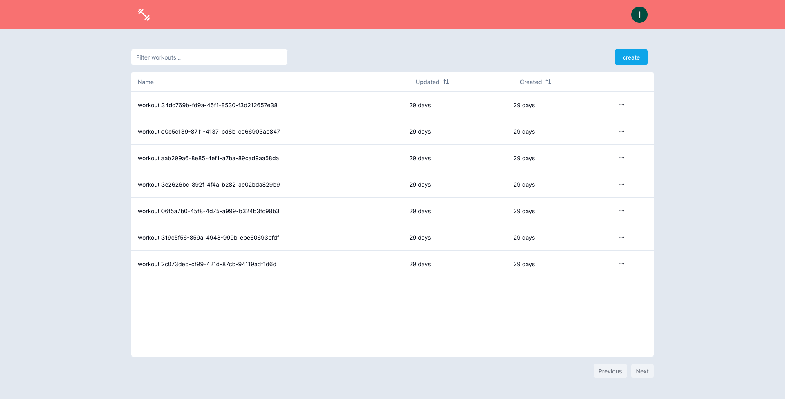
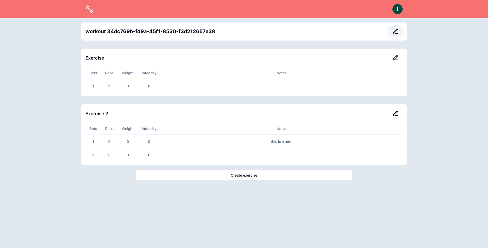

# PumpTrack

A minimatistic gym logger for those who want more simplicity and flexibility when logging their workouts.

## Why?

This project was created because I(DeyvisonIO) wanted a simple way to log my workouts without having to go through a list of 500 workouts only to find the exercise that I’m doing is not on that list. I wanted to created a gym logger that had more flexibility, where you’d put whatever workout and method of progressive overload you wanted, while having a little bit of a structure so you can easily see and edit the different sets, reps and weight.

## Features

- Supabase database to store your workouts
- List of created workouts sorted by date
- Flexibility adding a workout
- Ability to put notes for every set
- Ability to add new sets

## Pictures

## Improvements

Here are a list of possible improvements:

- Ability to create a new workout/exercise using a previous one as a template
- Ability to export your workout to google sheets
